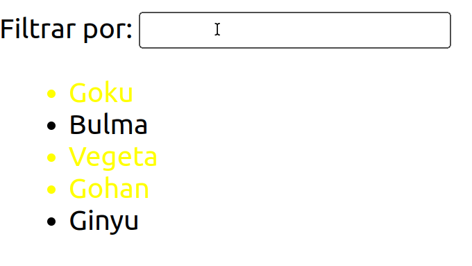

# Ejercicios

1. Implementar una aplicación en React que responda a la arquitectura de componentes definida en la siguiente imagen:

    

2. Implementar las siguientes funcionalidades asociadas a cada componente:

    - **AddContactForm**: Mostrar un formulario con los campos de un contacto (e.g., nombre, email y teléfono) que al hacer click en el botón de Añadir, introduzca un contacto nuevo en la lista de contactos.
    - **ContactList**: Mostrar la lista de contactos en todo momento.
    - **SearchBar**: Mostrar un campo de texto que a medida que se escriba en él, vaya filtrando los contactos a mostrar.

        

3. Implementar las siguientes funcionalidades en la aplicación:

    - Pedir los datos de contactos a la API pública de jsonplaceholder
    - Añadir dos botones al listado de Contactos:
      - Editar: Permite cambiar el nombre y otro campo (a elegir) de cada contacto.
      - Eliminar: Permite eliminar el contacto seleccionado.
