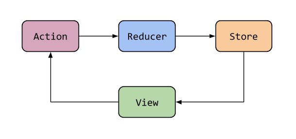
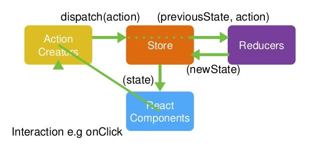

# Masterclass Redux

- Descripción y motivación
- Instalación y entorno
  - Creación del proyecto
  - DevTools
- Arquitectura del patrón
  - Stores
  - Actions
  - Reducers
  - Componentes
- Middlewares
  - Thunks
  - Slices

### Flujo básico

### Flujo detallado

### Arquitectura

## Referencias

https://redux.js.org/introduction/getting-started  
https://www.neoguias.com/tutorial-redux/  

https://www.freecodecamp.org/news/redux-thunk-explained-with-examples/  
https://www.digitalocean.com/community/tutorials/redux-redux-thunk-es  
